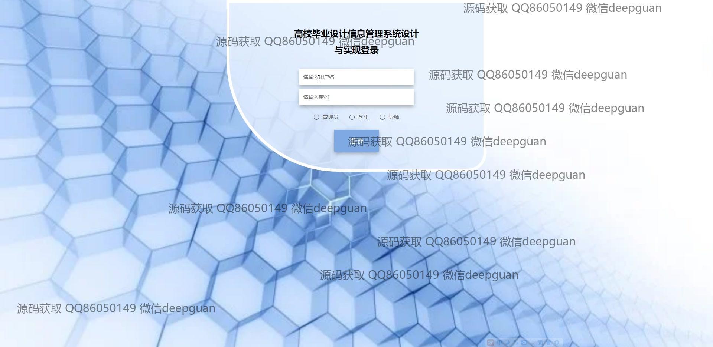

<h1 align="center">高校毕业设计信息管理系统设计与实现</h1>

## 简介
高校毕业设计信息管理系统：支持用户注册登录，课题信息管理，学生选题管理，论文提交与审核，公告发布，个人信息维护，导师管理，后台管理等功能。    --计算机毕业设计源码；毕设源码；java毕业设计源码

## 联系方式

<h3 align="center">获取完整代码与数据库文件 + 微信：deepguan QQ: 86050149 QQ群: 783742310</h3>

<h3 align="center">可帮忙远程部署 包运行成功！提供远程部署、修改代码、设计文档指导、代码讲解等服务！</h3>

## 功能介绍（完整见运行截图）
管理员：管理员可以通过登录界面选择身份进行身份验证，进入系统后，可管理多个功能模块，包括用户信息审核、课程管理以及公告发布。在系统管理区域，管理员能够监控系统运行状态，进行权限设置以及用户角色分配，并且可以审核和批准学生的课题申请和论文提交，确保系统的稳定运行和信息的准确管理。

学生：学生用户通过注册和登录功能进入系统，可以在个人中心修改和更新个人信息，如学号、姓名、专业等。学生可以选择毕业设计课题，提交论文及相关文件，并查看课题审核状态和答辩成绩。系统提供便捷的公告信息查看功能，以及选题管理和论文指导互动模块，帮助学生全面掌握毕业设计进度。

导师：导师在系统中负责学生课题的指导和审核，可以查看学生提交的选题和论文，提供导师信息输入和编辑功能，上传头像及个人信息维护。在课题审核、论文指导和答辩成绩管理方面，导师可以提供详细反馈和指导，以促进学生项目的顺利完成。

系统：系统整体设计简洁明了，提供自动补全专业选择、富文本编辑、文件上传等功能，支持不同用户角色的交互与管理。系统前端界面包括课程信息、公告发布、信息管理等模块，以直观和高效的操作方式，实现毕业设计信息的综合管理。

## 运行截图

本代码来源于网络,仅供学习参考使用!

